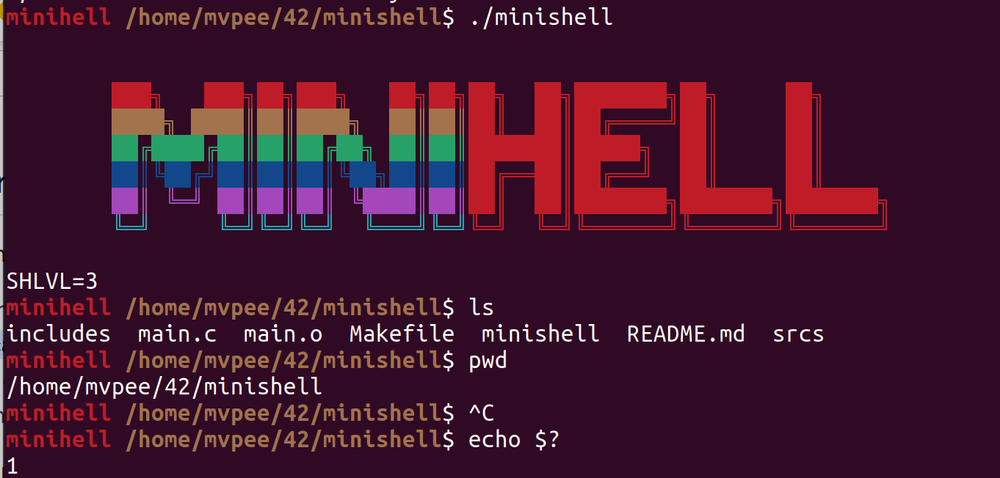

<h1 align="center">
	:shipit: 42-minishell
</h1>

<p align="center">
	
	
	
	
</p>

<h3 align="center">
	<a href="#-about">About</a>
	<span> · </span>
	<a href="#-running">Running</a>
	<span> · </span>
	<a href="#-features">Features</a>
</h3>


# 💡 About
>As beautiful as a shell

This project is about creating a simple shell. Yes, your own little bash. You will learn a lot about processes and file descriptors.

## 🚀 Running

```bash
make run
```
It will automatically compile the project and run it.
```bash
./minishell
```
Will launch the previously compiled project with `make` and run it.

------------

## 📜 Features

- **History**  
  -- Working history

- **`\`**  
  -- Supports escaping characters with backslashes for proper command interpretation

- **`'` `"`**  
  -- Supports proper parsing of single and double quotes for string handling

- **Redirections**  
  -- Supports input (`<`), here-doc (`<<`), output (`>`), and append (`>>`) redirections

- **Environnemts variables**  
  -- Supports retrieving, setting, and expanding environment variables

- **`$?`**  
  -- Displays the exit status of the last executed command

- **Signals**  
  -- Handles signals like CTRL-C (`interrupt`), CTRL-D (`EOF`), and CTRL-\ (`quit`)

- **Builtins**  
  -- `echo` with -n option  
  -- `cd` with relative, absolute, and `- ($OLDPWD)` paths  
  -- `pwd`  
  -- `export`  
  -- `unset`  
  -- `env`  
  -- `exit`  

- **Others**  
  -- *`$SHLEVEL`*  
    Increments `SHLVL` by one. Sets it to one if `SHLVL` is invalid (not between 1 and 999)  
  -- *`$PWD`*  
    Updates `PWD` to reflect the current directory after a `cd` command or if no `PWD` is present in the environment  
  -- *`$OLDPWD`*  
    Updates `OLDPWD` after a `cd` command or if no `OLDPWD` is present in the environment
  -- *Prompt*  
    A beautiful, colorful prompt that displays the current `PWD` at the beginning

<p align="center">
	
</p>

---

This group project was done by [MVPee](https://github.com/MVPee) and [Nour Echaara](https://github.com/noureh10)
